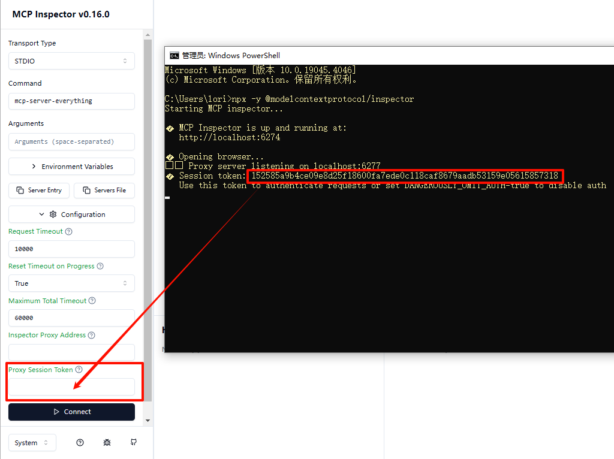
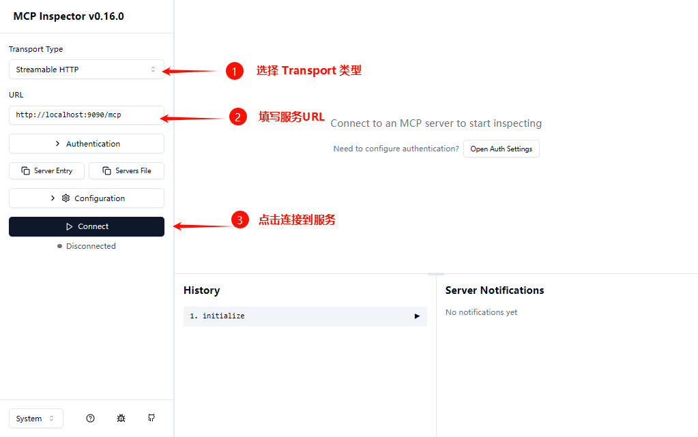
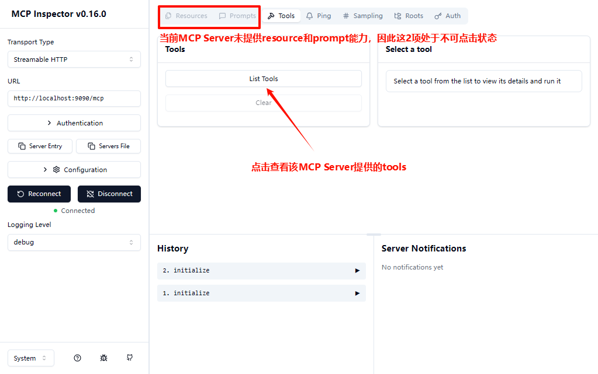
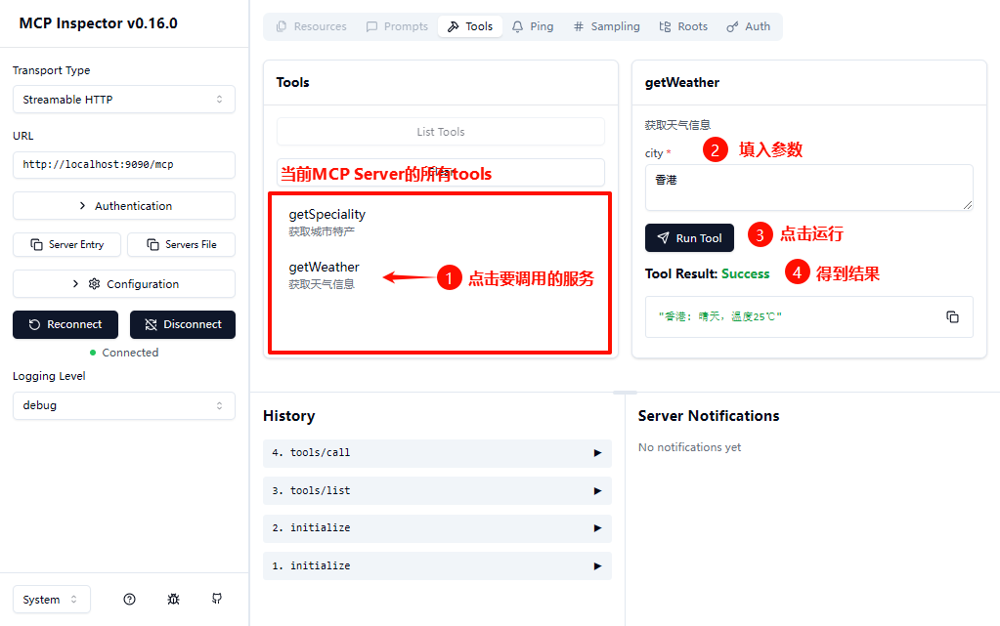

#  mcp-server-jdk8-example

## 📋 概述

这是一个基于[官方java mcp sdk 0.10.0的jdk8重构版(0.10.0-jdk8分支)](https://github.com/Lori888/mcp-java-sdk.git)构建MCP Server的示例项目，演示了如何了构建`STDIO/SSE/Streamable HTTP`的同步/异步MCP Server、以及如何开发tools。

## ✨ 项目结构

- `src/main/java` package `org.cafe.example.mcp`
  - `McpServer.java` - 应用程序入口点
  - `McpServerTool.java` - 具体的tools功能类，通过`@McpServerEndpoint`注解来定义MCP Server属性
  - `McpServerEndpointProcessor.java` - 用于解析`@McpServerEndpoint`注解以及`@Tool`注解标记的方法
  - `McpServerProperties.java` - 从spring-ai项目中copy过来的服务属性类
  - `McpToolInfo.java` - 用于描述tool的具体方法属性（例如参数名称、是否必须参数等）、通过`McpServerEndpointProcessor`解析产生
  - `TransportType.java` -  MCP  Server Transport枚举类
  - `util.*` - 一些工具类
  - `annotation.McpServerEndpoint` - MCP  Server注解，用于定义name、port、transport等属性
  - `org.springframework.ai.tool.annotation.*` - 从spring-ai项目中copy过来的注解类，用于定义tool

- `src/main/resources` 
  - `logback.xml` - 日志配置文件

- `src/test/java` package `org.cafe.example.mcp`
  - `SyncMcpClient.java` - 同步McpClient测试类

- `src/test/resources`
  - `logback.xml` - 日志配置文件

## 🎯 环境要求

- Java 8
- Maven 3.3+

## 🛠️ 运行应用

### 1.下载mcp-sdk-jdk8代码并安装到本地maven仓库中

```
git clone -b 0.10.0-jdk8 https://github.com/Lori888/mcp-java-sdk.git
cd mcp-java-sdk
mvn clean install
```

### 2.下载本示例工程代码并运行

```
git clone https://github.com/Lori888/mcp-java-sdk-examples.git
cd mcp-java-sdk-examples/mcp-server-jdk8-example
mvn exec:java -Dexec.mainClass="org.cafe.example.mcp.McpServer"
```

> [!NOTE]
>
> - 运行后将在`mcp-server-jdk8-example/logs`下产生日志文件
> - 默认使用`streamableHttp transport`类型，如需变更请修改`McpServerTool`中的`@McpServerEndpoint`代码
> - 如需实现其他tools，请修改`McpServerTool`

### 3.使用MCP Inspector进行测试（也可使用其他MCP客户端）

1.运行命令：

```
npx -y @modelcontextprotocol/inspector
```

等待浏览器窗口自动打开网页，将TOKEN填入：



2.配置服务地址等信息后，点击【Connect】连接服务：



3.服务连接成功后，点击【List Tools】查看该服务提供的tools：



4.显示所有tools后，点击某个tool进行调用：

