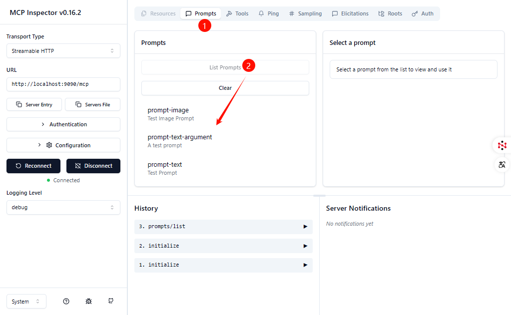
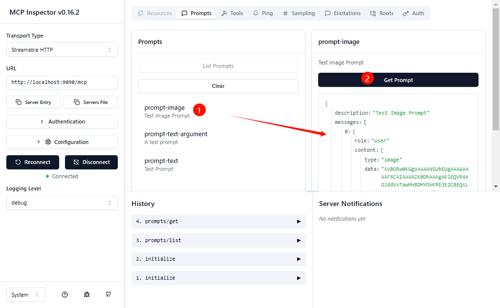
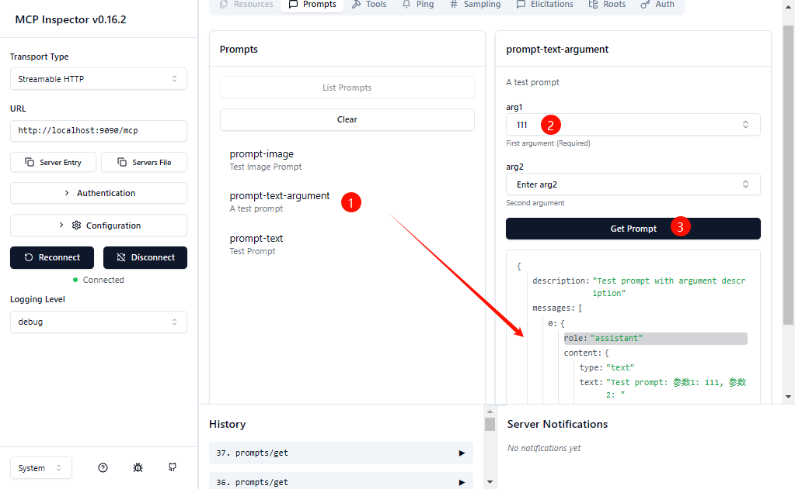
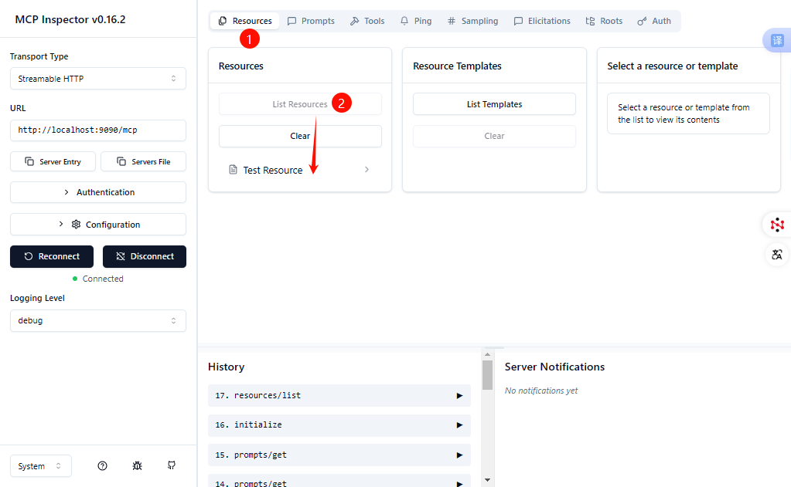
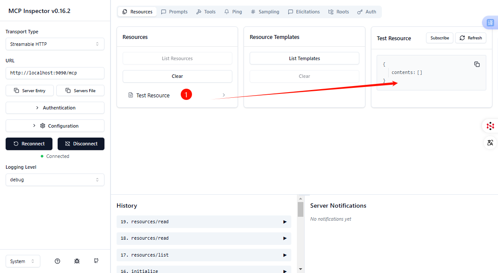

#  mcp-server-jdk8-example

## 📋 概述

这是一个基于[官方java mcp sdk 0.10.0的jdk8重构版(0.10.0-jdk8分支)](https://github.com/Lori888/mcp-java-sdk.git)构建MCP Server的示例项目，演示了如何了构建`STDIO/SSE/Streamable HTTP`的同步/异步MCP Server、以及如何提供`tools/prompts/resources`能力。

## ✨ 项目结构

- `src/main/java` package `org.cafe.example.mcp`
  - `McpServer.java` - 应用程序入口点
  - `McpServerEndpointProcessor.java` - 用于解析`@McpServerEndpoint`注解以及`@Tool`注解标记的方法
  - `McpServerProperties.java` - 从spring-ai项目中copy过来的服务属性类
  - `McpToolInfo.java` - 用于描述tool的具体方法属性（例如参数名称、是否必须参数等）、通过`McpServerEndpointProcessor`解析产生
  - `McpToolDef.java` - 用于描述tool的具体方法属性（例如参数名称、是否必须参数等）、通过`tool-list.json`反序列化产生
  - `McpServerTool.java` - 具体的tools功能类，通过`@McpServerEndpoint`注解来定义MCP Server属性、通过`@Tool`注解来定义tool方法
  - `McpTool.java` - 具体的tools功能类，无需添加`@Tool`注解、通过`tool-list.json`进行配置
  - `TransportType.java` -  MCP  Server Transport枚举类
  - `PromptProvider.java` -  Prompts 能力提供者
  - `ResourceProvider.java` -  Resources 能力提供者
  - `ToolProvider.java` -  Tools 能力提供者
  - `annotation.McpServerEndpoint` - MCP  Server注解，用于定义name、port、transport等属性
  - `util.*` - 一些工具类
  - `org.springframework.ai.tool.annotation.*` - 从spring-ai项目中copy过来的注解类，用于定义tool
  
- `src/main/resources` 
  - `logback.xml` - 日志配置文件

- `src/test/java` package `org.cafe.example.mcp`
  - `SyncMcpClient.java` - 同步McpClient测试类

- `src/test/resources`
  - `logback.xml` - 日志配置文件
  - `prompt/*` - Prompts 示例配置文件
  - `tool/tool-list.json` - Tools 示例配置文件

## **🤔** 设计思考

构建McpServer的大部分代码是可以通用的，`Tools/Prompts/Resources`能力最好可以通过配置来实现，这样可以避免重复编码。

### Tools

Tools能力可通过2种方式注入（详见`ToolProvider.java`）：

- 在具体的tool方法上添加@Tool注解

- 将tool配置在`%classpath%/tool/tool-list.json`文件中

  - `tool-list.json`文件内容格式为MCP `tools/list`的`Response`中的`"tools"`节点（不包含`"tools"`本身），并另外增加了`"targetBeanClass"`和`"targetMethodName"`、用于将tool的定义和具体的实现方法关联起来

  - `tool-list.json`支持通过工具方法来产生（详见`FileUtils.createToolListJsonFile`方法）

### Prompts

Prompts能力也支持通过配置注入（详见`PromptProvider.java`）：

- 所有prompt配置统一存放于prompts配置文件夹下：该文件夹路径可通过`-Dmcp.prompt.dir`进行指定，默认使用`%classpath%/prompt`作为配置文件夹。

- prompts配置文件夹下首先要有` prompt-list.json` ：该文件为该MCP Server所提供的所有prompts能力列表，文件内容格式为MCP `prompts/list`的`Response`中的`"prompts"`节点（包含`"prompts"`本身）。

- 在prompts配置文件夹下创建具体的prompt，每个prompt对应1个独立的文件：

  - 文件名格式为：`%promptName%.后缀`（`%promptName%`需和` prompt-list.json`中配置的name保持一致、后缀根据类型而有所不同）

  - 文本类型的prompt：`%promptName%.json`（文件内容格式为MCP `prompts/get`的`Response`中的`"result"`的子节点、不包含`"result"`本身；如果是带参数的prompt、则使用`%s`作为参数占位符）。

  - 图片类型的prompt：`%promptName%.png/jpg/jpeg` （当前仅支持这些图片类型）

  - 资源类型的prompt：TODO

### Resources

Resources能力也支持通过配置注入：TODO

## 🎯 环境要求

- Java 8
- Maven 3.3+

## 🛠️ 运行应用

### 1.下载mcp-sdk-jdk8代码并安装到本地maven仓库中

```
git clone -b 0.10.0-jdk8 https://github.com/Lori888/mcp-java-sdk.git
cd mcp-java-sdk
mvn clean install
```

### 2.下载本示例工程代码并运行

```
git clone https://github.com/Lori888/mcp-java-sdk-examples.git
cd mcp-java-sdk-examples/mcp-server-jdk8-example
mvn exec:java -Dexec.mainClass="org.cafe.example.mcp.McpServer"
```

> [!NOTE]
>
> - 运行后将在`logs`下产生日志文件
> - 默认使用`streamableHttp transport`类型，如需变更请修改`McpServerTool`中的`@McpServerEndpoint`代码
> - 如需实现其他tools，请修改`McpServerTool`

### 3.使用MCP Inspector进行测试（也可使用其他MCP客户端）

1.运行命令（ 需先安装`Node.js`）：

```
npx -y @modelcontextprotocol/inspector
```

等待浏览器窗口自动打开网页，~~将TOKEN填入~~ (最新版本已自动填入)：


2.配置服务地址等信息后，点击【Connect】连接服务：


3.服务连接成功后，点击【List Tools】查看该服务提供的tools：


4.显示所有tools后，点击某个tool进行调用：


5.点击【List Prompts】可查看该服务提供的prompts：



6.显示所有prompts后，点击某个prompt进行调用：





7.点击【List Resources】可查看该服务提供的resources：



8.显示所有resources后，点击某个resource进行读取：

